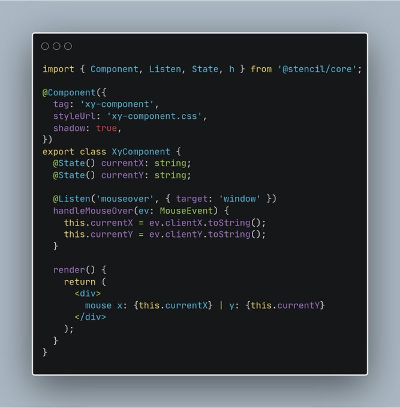

# xy-component.github.io
&lt;xy-component> native Web Component displaying X,Y mouse coordinates

```html	
  <xy-component></xy-component>
```

## Using Native JavaScript

```javascript
customElements.define("xy-component", class extends HTMLElement {
    constructor(
        x = document.createElement("b"), 
        y = document.createElement("b")
    ) {
        super().attachShadow({ mode: "open" }).append("Mouse X: ", x, " Y: ", y);
        Object.defineProperties(this, {
            x: { get: v => Number(x.innerHTML), set: v => x.innerHTML = v },
            y: { get: v => Number(y.innerHTML), set: v => y.innerHTML = v }
        });
        window.addEventListener("mousemove", e => (this.x = e.clientX,this.y = e.clientY));
    }
});
```

## Using StencilJS (+18Kb)

